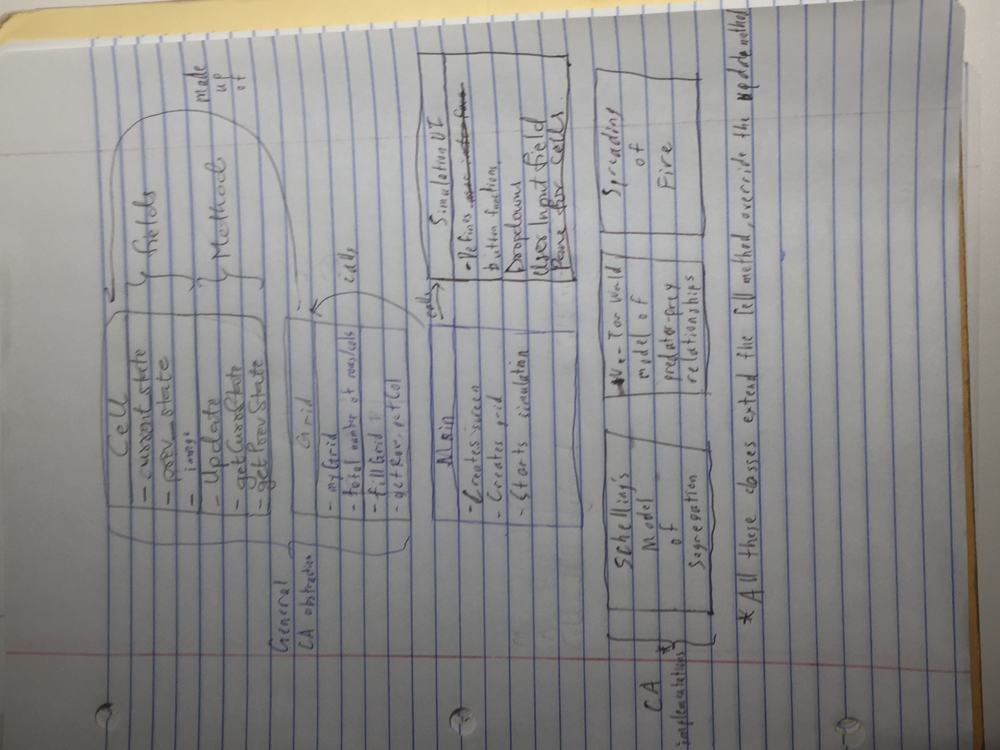
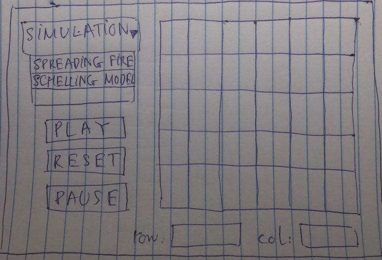

cell society
====

##Introduction:

* Problem: how to simulate these real world scenarios(the above chosen systems) 
and observe how they interact with each other over a long period of time based 
on the specific features that affect each entity. 

* Design goals: Model a general cell that any real world scenario can extend from. 
This cell abstraction contains enough generic features(class fields) and cell 
actions(class methods) possible. Model a generic grid that can create any number of 
grids required for the specific real world scenario being modeled.

* Primary architecture: The architecture of our project would consist of a Cell.java 
class that serves as a super class for different simulations of CAs we want to make. 
The Grid.java class would be closed for internal modification and to update the Cells. 
 
 
##Overview:

We plan to create two general classes, Cell and Grid, to represent a general CA simulation. Cell represents a specific cell and the information tied to the cell. Grid represents the overall grid of cells, and will contain a two dimensional Cell array. There will also be two classes used for the front end: SimulationUI, which contains buttons, dropdowns, user input fields, and the pane for cells, and Main, which will create a stage, scene, grid, and launch the application. Any specific CA simulation will extend the Cell class. Each simulation will override the update() method to enforce its own set of rules on the simulation.

##User Interface:

For our Cell Society, the users would be able to determine the size (row & column) of 
the grid. There will be a drop down that users can determine what simulation they want 
to run, which will choose a class of simulation that will be run. We would have three 
buttons: PLAY, RESET, and PAUSE, that will let the users control the current Cell simulation. 

###Design Details:

* **Cell**
    * currState(field): Field that defines the current state of the cell
    * prevState(field): Field that defines the previous state of the cell. When the cell updates, it will store the currState fields into the prevState fields and use the prevState fields to find the next currState fields.
    * image(field): Stores the name of the image file to display for the cell
    * update(method): Updates the prevState and currState fields in the cell. Will examine the currState of neighboring cells to determine how the cell will behave.
    * getCurrState(method): Getter method for currState
    * getPrevState(method): Getter method for prevState
    * resources needed: image files for each of the different states of the cells
    * Can extend Cell to fit any number of simulations
* **Grid**
    * myGrid(field): A two-dimensional Cell array where the simulation takes place
    * rows(field): The total number of rows in the grid
    * columns(field): The total number of columns in the grid
    * fillGrid(method): A method that generates myGrid and the initial state of all cells
    * getRow(method): Getter method that returns the total number of rows
    * getColumn(method): Getter method that returns the total number of columns
    * The grid class contains the backend details and methods that organizes cells into a two-dimensional array, so making it a separate class helps organize the code
* **SimulationUI**
    * createPauseButton, createPlayButton, createResetButton: creates the specified button. Clicking a button will call the appropriate method.
    * createDropDown: creates a dropdown menu with the names of all available simulations to choose from. Selecting a simulation from the menu will automatically initialize the simulation.
    * rowInputField, columnInputField: Fields where the user will enter a specified number of rows and columns.
    * paneForCells: Creates a pane to display the two-dimensional grid. Will call on the Grid class to help determine how big the cells will be, and will call on the Cell class to determine which images to display.
    * pauseSimulation(method): Method that will pause the simulation
    * resetSimulation(method): Method that will revert the simulation back to its initial state
    * playSimulation(method): Method that will start a simulation or continue a paused simulation
    * This class creates the main front end components of the CA simulations, so keeping it separate from Main should help with organization
* **Main**
    * createScene(method): Sets a stage and scene according to the UI design.
    * start(): Specifies what the application should do when it launches. Will set up a start screen that welcomes the user and have a "Start" button to bring the user to the main UI screen.
* **Other simulation classes**
    * Schelling's Model of Segregation
    * Wa-Tor World Model of Predator-Prey Relationships
    * Spread of Fire
    * Each simulation will extend Cell
    * Each simulation will override the update() method in Cell to fit the rules of the simulation

###Design Considerations:
* Deliberation on where we want to create the grid for the cells. 
The Grid class, SimulationUI class and Main class are all possible options. 
A possible way we could do is to call the Grid, and the SimulatioUI class inside the Main class.

* The storage of the previous cell states were ambiguous. The options were going for the instance 
where each cell stores its own previous and current state or have a new pointer point to the whole 
previous generation 2D array. We settled for having former option since the latter seems more 
complicated to implement. 

* Another design consideration we made is to make a seperate class for each buttons in the UI interface. 
The pros this design brings is the ease in navigating around the buttons; the cons would be that since 
each buttons only controls the flow of simulation, it would be better to put them in one class.

###Team Responsibilities: